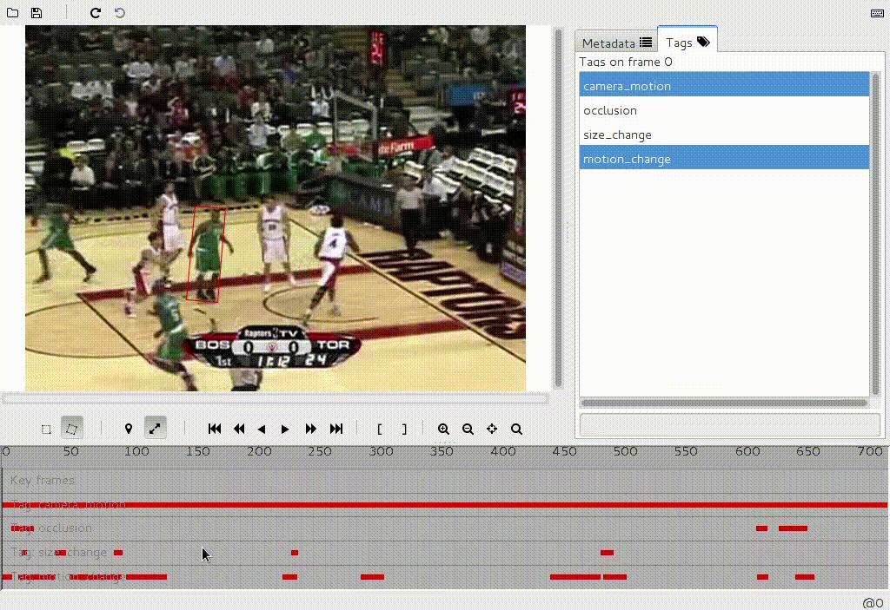

Aibu - image sequence annotator
===============================

Aibu is an image sequence annotator developed and used by the [VOT challenge](http://votchallenge.net/). User can annotate movement of a single target in an image sequence.

The annotator was only used within the VOT challenge organization until now and is therefore considered an alpha level software. A lot of features are missing or are not fully polished. If you find such a case you are welcome to open an issue report on Github.

Features:

* input: image sequence
* per-frame tags
* bounding box interpolation
* aligned or rotated bounding box
* undo, redo

Building
--------

The annotator is written in Java and can be built using Ant build tool. It depends on the [coffeshop](https://github.com/lukacu/coffeeshop) library.

    $ # build and add coffeshop library to your classpath
    $ ant
    
`deploy/aibu.jar` will be created

Using
-----

    $ java -jar deploy/aibu.jar si.vicos.annotations.editor.Annotator
    
Sample Annotations
------------------

Available on http://votchallenge.net/.
